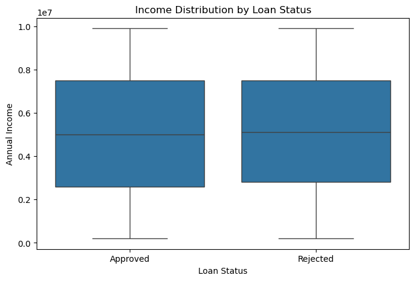
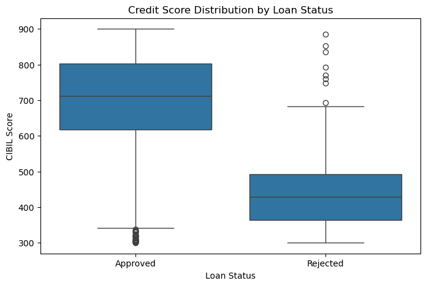
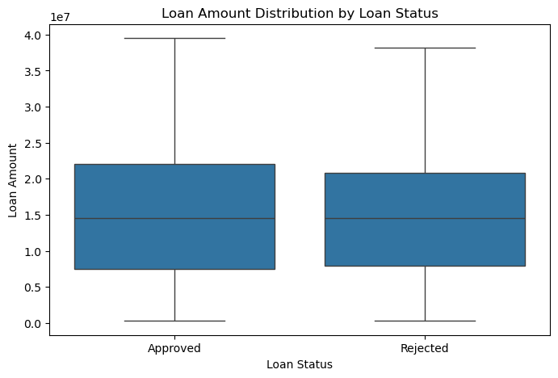
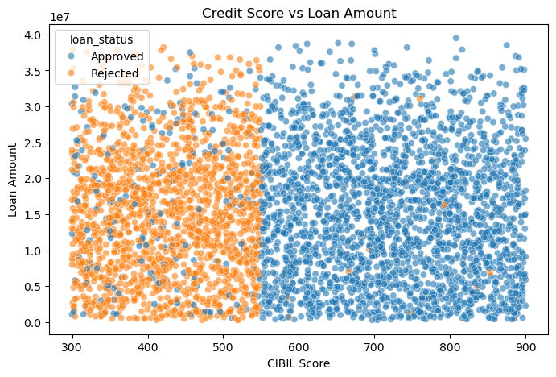

# Loan Approval Prediction – EDA & Modeling Overview

## Objective
Analyze factors influencing loan approval decisions and build a predictive model using applicant financial and credit data.

---

## Dataset Summary
- **Records:** 4,269  
- **Target Variable:** Loan Status (Approved / Rejected)  
- **Key Features:**
  - CIBIL Score
  - Loan Amount
  - Annual Income
  - Asset Values (Residential, Commercial, Luxury, Bank)

---

## Exploratory Data Analysis (EDA) Insights

### 1. Income vs Loan Approval
- Median income levels for approved and rejected applicants are very similar.
- Income alone does not strongly differentiate loan outcomes.

---

### 2. Credit Score as a Key Driver
- Approved loans have a much higher median CIBIL score (~710).
- Rejected loans cluster around lower scores (~430).
- Clear threshold behavior observed around **550–600**.

---

### 3. Loan Amount Impact
- Approved and rejected loans show nearly identical loan amount distributions.
- Loan amount alone does not determine approval.

---

### 4. Credit Score vs Loan Amount
- Credit score dominates approval decisions regardless of loan size.
- High-score applicants are approved across a wide range of loan amounts.

---

## Approval Rates by Credit Band

| CIBIL Band | Approval Rate |
|-----------|---------------|
| Low       | ~10%          |
| Medium    | ~68%          |
| Good      | ~99%          |
| Excellent | ~99%          |

---

## Modeling Summary

### Models Used
- Logistic Regression
- Random Forest

### Performance
- **Accuracy:** 73%
- **ROC-AUC:** 0.81

### Key Findings
- CIBIL score is the most influential feature.
- Loan amount and asset values have marginal impact.

---

## Key Conclusion
Credit score acts as a **threshold variable** in loan approval decisions. Once applicants cross a critical CIBIL range, approval likelihood increases sharply, while loan amount and asset values play a secondary role.

---

> **Note:**  
> This repository presents a high-level overview of the analysis and results.  
> Full implementation code and datasets are intentionally excluded.
